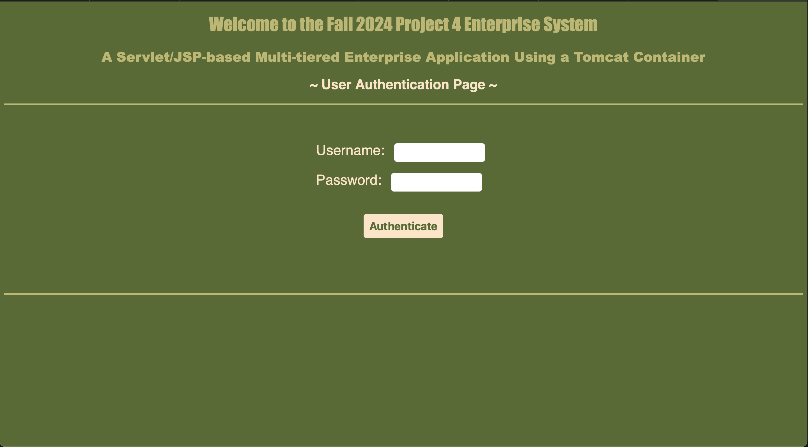
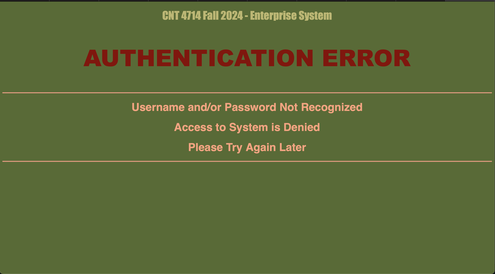
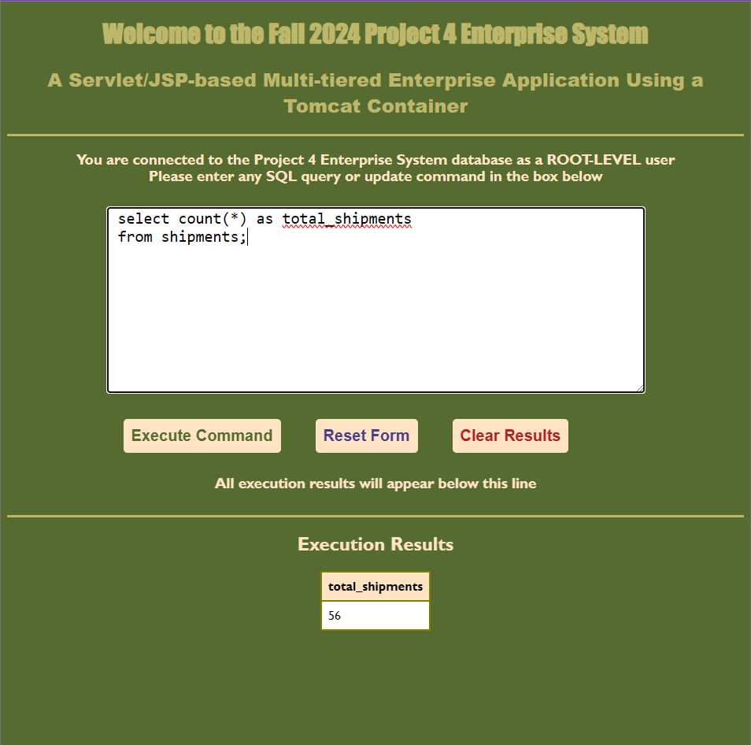
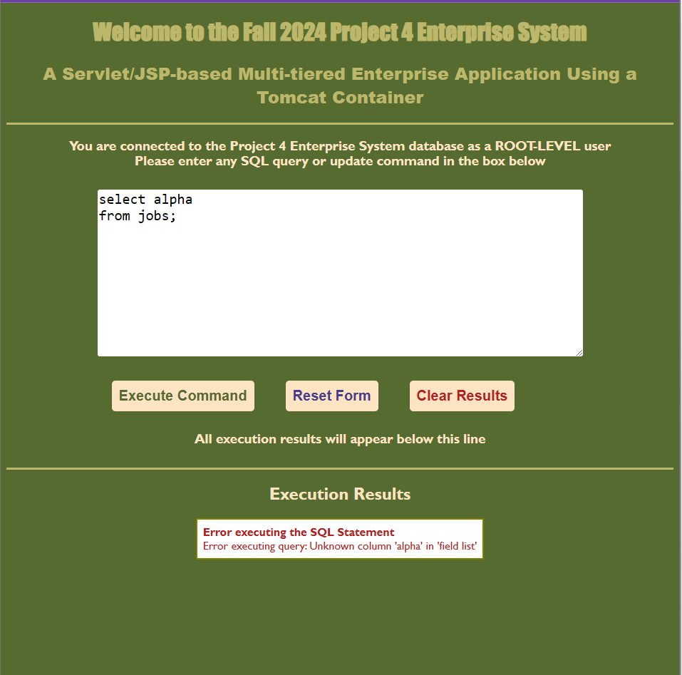
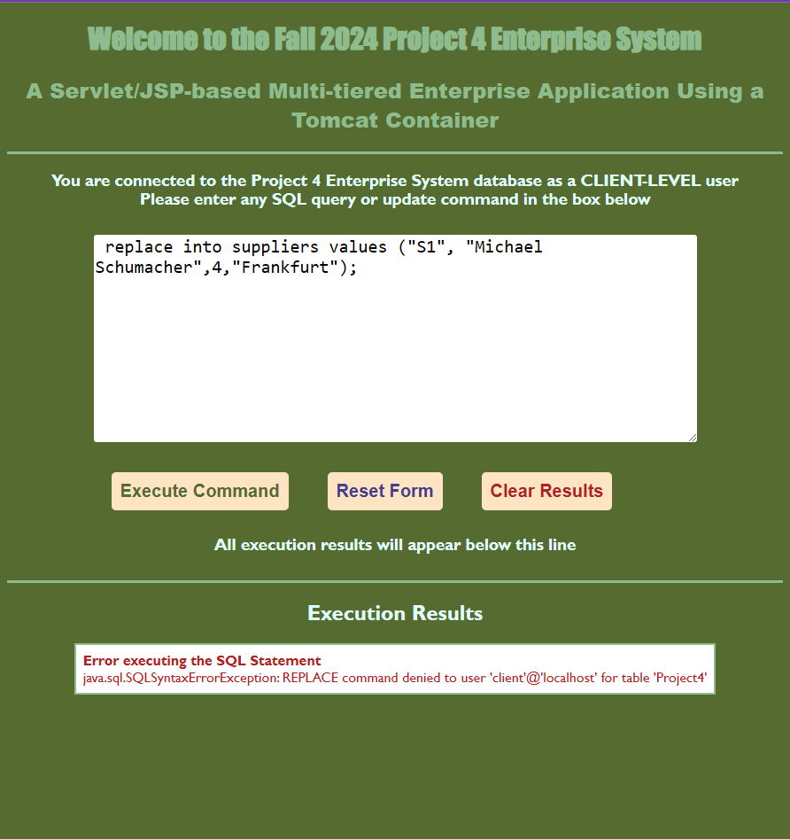
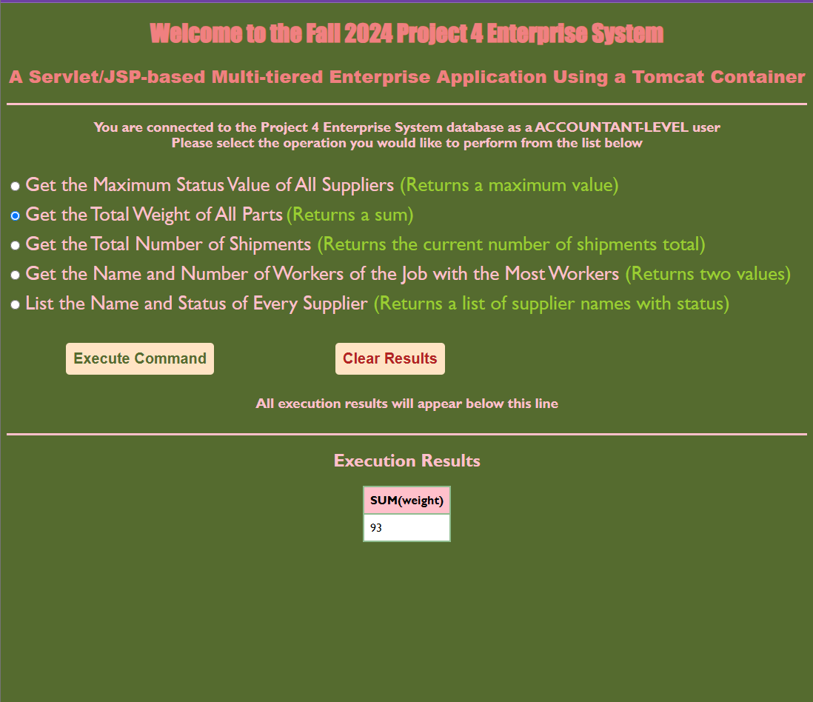

# Servlet-Application
### Mock database manager for fictional shipyard
This is an application that uses tomcat servlets. It is supposed to emmulate a managment application for a fake shipyard's database.   
### Home Screen
You start on the Home screen where it asks you to log in. You have three options, The Root User, the Client User, and the Accountant User. Each one has a different UI and different database permissions.  
  
If you input a username or password that does not match any of the credentials, then it'll throw up and error and ask you to try again.
  
### Root User
The Root user has full acess to the database and can input any commands they wish. 
 
 
 
 

